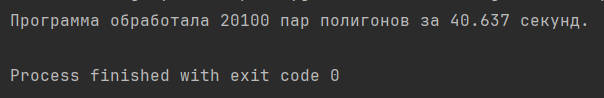
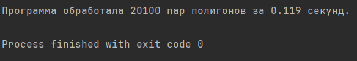

### Задание:

* Проверить, пересекаются ли два произвольных прямоугольника
* Визуализировать их с помощью Matplotlib

### Решение 1:

Отрезки AB и CD пересекаются тогда и только
тогда, когда точки A и B разделены отрезком CD, а точки C и D разделены отрезком AB.

* Если точки A и B разделены отрезком
  CD, то ACD и BCD должны иметь противоположную ориентацию, что
  означает, что либо ACD, либо BCD направлены против часовой
  стрелки, но не оба сразу.

````   
def __intersect__(self, A, B, C, D):
    def ccw(A, B, C):
        return (C.y - A.y) * (B.x - A.x) > (B.y - A.y) * (C.x - A.x)
    return ccw(A, C, D) != ccw(B, C, D) and ccw(A, B, C) != ccw(A, B, D)
````

* 
### Решение 2:

* GJK — это алгоритм, предназначенный для определения пересечения двух выпуклых фигур. Он реализуется при помощи
  разности Минковского и оптимизирован при помощи обобщённой «вспомогательной функции» и симплексов.

### Результат работы:



* (В 341 раз быстрее, чем в в случае решения 1)